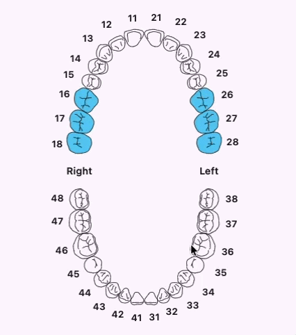
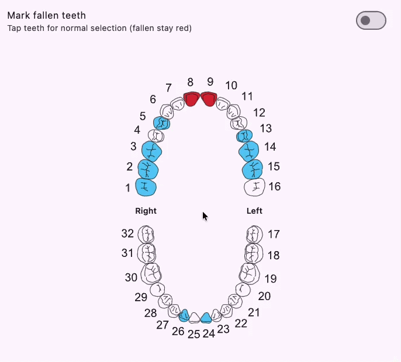

# Dental Teeth Selector 🦷

Flutter widget to select teeth for dental and medical use.

Supports **Universal** (ADA, `1`–`32`) and **European** (FDI / ISO 3950) numbering, plus **fallen / missing teeth**.

## Preview 📸

<table>
  <tr>
    <td align="center" width="50%">
      <strong>Universal numbering</strong><br/>
      
    </td>
    <td align="center" width="50%">
      <strong>European numbering</strong><br/>
      
    </td>
  </tr>
</table>

### Fallen teeth preview 🦷

<p align="center">
  
</p>

## Install ⬇️

```bash
flutter pub add dental_teeth_selector
```

## Usage 🚀

### Universal (default)

```dart
import 'package:dental_teeth_selector/dental_teeth_selector.dart';

DentalTeethSelector(
  numberingSystem: TeethNumberingSystem.universal, // default
  initiallySelected: const ['8', '9'],
  selectedColor: Colors.teal,
  toothColor: Colors.black,
  numberColor: Colors.black,
  rightLabel: 'Right', // between teeth 1 and 32
  leftLabel: 'Left',   // between teeth 16 and 17
  labelColor: Colors.black54,
  width: 320,
  height: 480,
  onSelected: (teeth) {
    // List<String> => ['8', '9']
  },
)
```

### European (FDI)

```dart
DentalTeethSelector(
  numberingSystem: TeethNumberingSystem.european,
  initiallySelected: const ['11', '21'],
  onSelected: (teeth) {
    // List<String> => ['11', '21']
  },
)
```

### Fallen teeth

```dart
DentalTeethSelector(
  showFallenTeeth: true,
  fallenTeeth: const ['1', '16'], // requires showFallenTeeth: true
  selectingFallenTeeth: markFallenMode, // determine of we are selecting falling teeth or not
  initiallySelected: const ['8', '9'], // must not overlap fallenTeeth
  fallenColor: Colors.red,
  onSelected: (teeth) { /* normal selection */ },
  onFallenChanged: (fallen) { /* updated fallen ids */ },
)
```

## Numbering systems 🔢

| System | Enum value | Ids |
|---|---|---|
| Universal (ADA) | `TeethNumberingSystem.universal` | `"1"` … `"32"` |
| European (FDI / ISO 3950) | `TeethNumberingSystem.european` | `"11"`–`"18"`, `"21"`–`"28"`, `"31"`–`"38"`, `"41"`–`"48"` |

Helpers `convertToothId` / `convertToothIds` map between systems.

## API ⚙️

| Parameter | Description |
|---|---|
| `numberingSystem` | `universal` (default) or `european` (FDI) |
| `onSelected` | Callback with the current selected tooth ids |
| `initiallySelected` | Tooth ids selected on first load (match `numberingSystem`) |
| `showFallenTeeth` | Enable fallen / missing teeth (default `false`) |
| `fallenTeeth` | Fallen tooth ids (requires `showFallenTeeth`) |
| `selectingFallenTeeth` | Tap toggles fallen instead of selection |
| `onFallenChanged` | Callback when fallen set changes |
| `fallenColor` | Fill for fallen teeth (default red) |
| `selectedColor` | Fill for selected teeth |
| `toothColor` | SVG tooth outline stroke color |
| `numberColor` | Tooth number color |
| `rightLabel` | Text on patient's right (Universal 1/32, European 18/48) |
| `leftLabel` | Text on patient's left (Universal 16/17, European 28/38) |
| `labelColor` | Color for the jaw side labels |
| `width` / `height` | Chart size |
| `multiSelect` | Allow multiple teeth (default `true`) |

## Author 🧡
Made With love by [Emad Beltaje](https://github.com/emadbeltaje)
