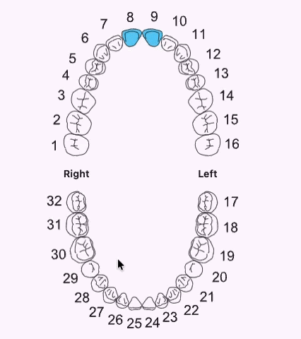

# dental_teeth_selector 🦷

Interactive Universal Numbering System dental chart for Flutter.

## Preview 📸



## Install ⬇️

```bash
flutter pub add dental_teeth_selector
```

## Usage 🚀

```dart
import 'package:dental_teeth_selector/dental_teeth_selector.dart';

DentalTeethSelector(
  initiallySelected: const ['8', '9'],
  selectedColor: Colors.teal,
  toothColor: Colors.black,
  numberColor: Colors.black,
  rightLabel: 'Right', // between teeth 1 and 32
  leftLabel: 'Left',   // between teeth 16 and 17
  labelColor: Colors.black54,
  width: 320,
  height: 480,
  onSelected: (teeth) {
    // List<String> => [1,2,3]
  },
)
```

See the [`example/`](example/) app for a full demo.

## API ⚙️

| Parameter | Description |
|---|---|
| `onSelected` | Callback with the current selected tooth ids |
| `initiallySelected` | Tooth ids selected on first load |
| `selectedColor` | Fill for selected teeth |
| `toothColor` | SVG tooth outline stroke color |
| `numberColor` | SVG tooth number fill color |
| `rightLabel` | Text between teeth 1 and 32 (default `"Right"`) |
| `leftLabel` | Text between teeth 16 and 17 (default `"Left"`) |
| `labelColor` | Color for the jaw side labels |
| `width` / `height` | Chart size |
| `multiSelect` | Allow multiple teeth (default `true`) |

## Author 🧡
Made With love by [Emad Beltaje](https://github.com/emadbeltaje)